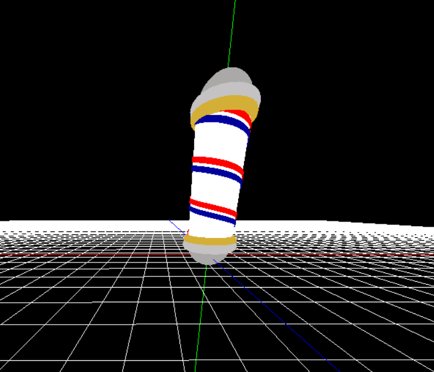
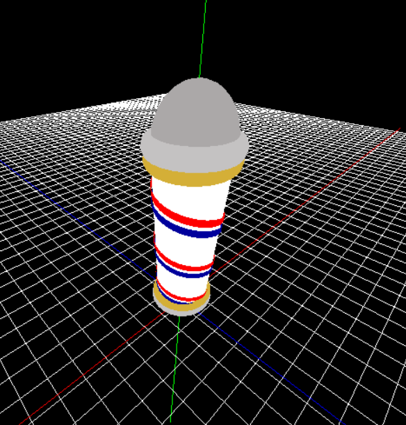
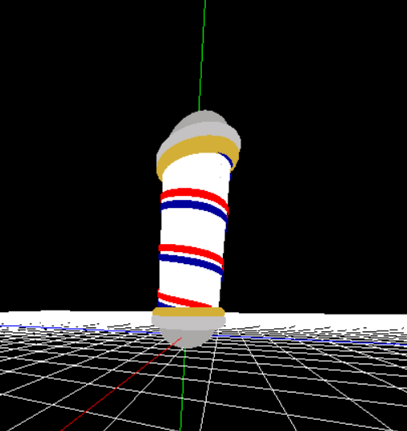

## Introduction

In this post, we'll explore the creation of an animated barber pole with OpenGL. The project involves combining graphics programming concepts with animation techniques to bring a traditional barber pole to life.

## Drawing a Cylinder

The `drawCylinder` function is responsible for rendering a cylindrical shape using quad strips. This function is crucial for creating the main pole of the barber pole in the project.

```c++
void drawCylinder(float radius, float height) {
    // Initialize angle and the number of divisions (n) for creating quad strips
    float angle = 0;
    int n = 30;

    // Begin drawing with quad strips
    glBegin(GL_QUAD_STRIP);

    // Iterate through the quad strips
    for (int c = 0; c <= n; c++) {
        // Calculate x and z coordinates based on the current angle
        double x = radius * cos(angle);
        double z = radius * sin(angle);

        // Draw the vertices for the current quad strip
        glVertex3f(x, 0, z);
        glVertex3f(x, height, z);

        // Increment the angle for the next iteration
        angle = angle + ((2 * PI) / n);
    }

    // End the drawing of quad strips
    glEnd();
}
```

## Drawing a Helix

The `drawHelix` function is responsible for rendering a helical structure, following a similar approach as the cylinder but gradually incrementing the `y` coordinate.

```c++
void drawHelix(float radius, float height, float gap, float thickness, float startHeight) {
    // Initialize angle, y-coordinate, and the number of divisions (n) for creating quad strips
    float angle = 0;
    float y = startHeight;
    int n = 30;

    // Begin drawing with quad strips
    glBegin(GL_QUAD_STRIP);

    // Draw the helix loops while incrementing the y-coordinate
    while (y <= height) {
        // Calculate x and z coordinates based on the current angle
        double x = radius * cos(angle);
        double z = radius * sin(angle);

        // Draw the vertices for the current quad strip
        glVertex3f(x, y, z);
        glVertex3f(x, y + thickness, z);

        // Increment the angle and y-coordinate for the next iteration
        angle = angle + ((2 * PI) / n);
        y = y + gap;
    }

    // End the drawing of quad strips
    glEnd();
}
```

## Drawing the Barber Pole

The `drawPole` function is responsible for rendering the complete structure of the barber pole. This function combines the main cylindrical pole with additional decorative elements.

``` c++
void drawPole(float radius, float height) {
    // Save the current transformation state
    glPushMatrix();
    
    // Rotate the entire structure based on the scene rotation for animation
    glRotatef(sceneRotation, 0.0, 1.0, 0.0);

    // Save the current transformation state for the main pole
    glPushMatrix();
    glRotatef(0, 0, 1, 0);
    glColor3f(1, 1, 1);
    
    // Draw the main cylinder (Pole)
    drawCylinder(radius, height);
    
    glColor3f(0, 0, 0.61);
    
    // Draw the first radius (blue helix)
    drawHelix(radius + 0.05, height, 0.05, 0.2, 0);

    glColor3f(1, 0, 0);
    
    // Draw the second radius (red helix)
    drawHelix(radius + 0.05, height, 0.05, 0.2, 0.3);

    // Restore the transformation state for the main pole
    glPopMatrix();
    
    // Restore the original transformation state
    glPopMatrix();

    // Draw a sphere at the top
    glPushMatrix();
    glColor3f(0.67, 0.66, 0.66);
    glTranslatef(0, height, 0);
    glutSolidSphere(radius, 30, 30);
    glPopMatrix();

    // Draw a larger torus at the top
    glPushMatrix();
    glColor3f(0.77, 0.76, 0.76);
    glTranslatef(0, height, 0);
    glRotatef(-90, 1, 0, 0);
    glutSolidTorus(radius / 4 * 0.9, radius, 25, 25);
    glPopMatrix();

    // Draw a smaller torus at the top
    glPushMatrix();
    glColor3f(.8314, .6863, .2157);
    glTranslatef(0, height - radius / 4, 0);
    glRotatef(-90, 1, 0, 0);
    glutSolidTorus(radius / 5, radius, 25, 25);
    glPopMatrix();

    // Draw a sphere at the bottom
    glPushMatrix();
    glColor3f(0.67, 0.66, 0.66);
    glutSolidSphere(radius, 30, 30);
    glPopMatrix();

    // Draw a larger torus at the bottom
    glPushMatrix();
    glColor3f(0.77, 0.76, 0.76);
    glRotatef(-90, 1, 0, 0);
    glutSolidTorus(radius / 4, radius, 25, 25);
    glPopMatrix();

    // Draw a smaller torus at the bottom
    glPushMatrix();
    glColor3f(.8314, .6863, .2157);
    glTranslatef(0, radius / 4, 0);
    glRotatef(-90, 1, 0, 0);
    glutSolidTorus(radius / 5, radius, 25, 25);
    glPopMatrix();
}
 ```
 ## Output







 ## Conclusion

In this project, we delved into the world of graphics programming using GLUT and OpenGL to create a visually appealing animated barber pole.

Feel free to explore the complete source code here and experiment with different parameters to customize the barber pole further. I hope this project serves as an educational and inspiring resource for fellow graphics enthusiasts!

