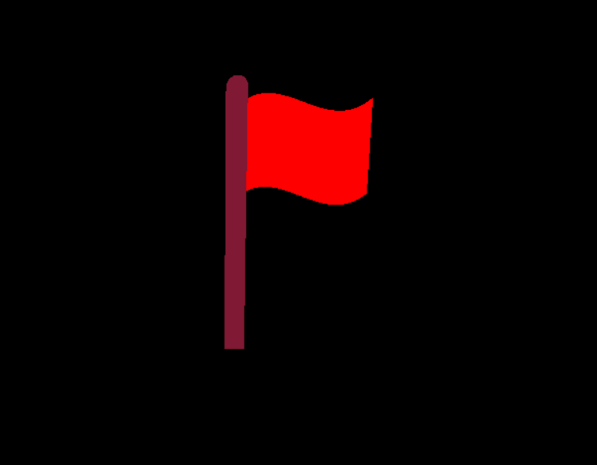
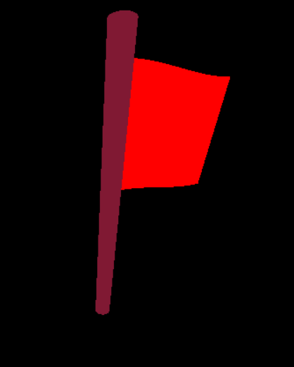

## Introduction 

Bezier curves play a crucial role in computer graphics, offering a precise way to define smooth paths. In this blog post, we'll dive into the practical side of bezier curves, using them to create a simple yet captivating waving flag simulation in OpenGL.

Bezier curves are a fundamental mathematical concept widely employed in computer graphics and design. Developed by the French engineer Pierre Bézier, these curves provide a flexible and intuitive way to represent smooth and aesthetically pleasing shapes. Bezier curves are particularly popular in applications such as computer-aided design (CAD), vector graphics, and animation.
Definition and Control Points

At its core, a Bezier curve is defined by a set of control points. For a cubic Bezier curve, four control points \\( P0 , P1 \ and \ P2\\) are used to determine  the shape of the curve. The curve starts at P0, ends at P3, and is influenced by the intermediate control points P1 and P2.

The equation for a cubic Bezier curve \\( B(t)\\) is expressed as:

$$ B(t) = (1 - t)^3 \cdot P_0 + 3(1 - t)^2 \cdot t \cdot P_1 + 3(1 - t) \cdot t^2 \cdot P_2 + t^3 \cdot P_3 \$$

Here, \\( t \ \\)is a parameter that varies between 0 and 1, influencing the position of points along the curve.

### Order of Bezier Curves

The order of a Bezier curve corresponds to the number of control points used. A cubic Bezier curve, with four control points, is the most common. However, Bezier curves can be of any order, each introducing an additional level of control and complexity.

## OpenGL implementation 

``` c++ 

void drawAnimatedBezierFlag(float flagHeight)
{
    // Define control points for the cubic Bezier curve
    float P0[] = {0, 0};
    float P1[] = {1, 1 };
    float P2[] = {2, -1};
    float P3[] = {3, 0};

    glPushMatrix();
    // Set the color for the flag
    glColor3f(1, 127 / 255, 80 / 255);

    glBegin(GL_QUAD_STRIP);

    // Iterate through parameter values (t) to evaluate points on the curve
    for (float t = 0; t <= 1; t += 0.01)
    {
        // Compute the x and y coordinates of a point on the Bezier curve
        GLfloat x = pow((1 - t), 3) * P0[0] + 3 * pow((1 - t), 2) * t * P1[0] + 3 * (1 - t) * pow(t, 2) * P2[0] + pow(t, 3) * P3[0];
        GLfloat y = pow((1 - t), 3) * P0[1] + 3 * pow((1 - t), 2) * t * P1[1] + 3 * (1 - t) * pow(t, 2) * P2[1] + pow(t, 3) * P3[1];

        glVertex3f(x, y + flagHeight, 0); //top vertex
        glVertex3f(x, y, 0); //botton vertex
    }

    glEnd();
    glPopMatrix();
}

```
Here GL_QUAD_STRIP is utitlized to create the flag shape by iterating 100 steps of the parameter t.The two vertices for each iteration is obtained by the above discussed Bezier curve equation.

## Results 



