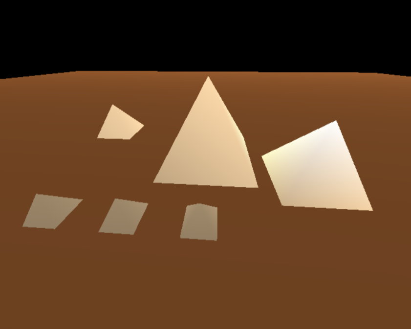
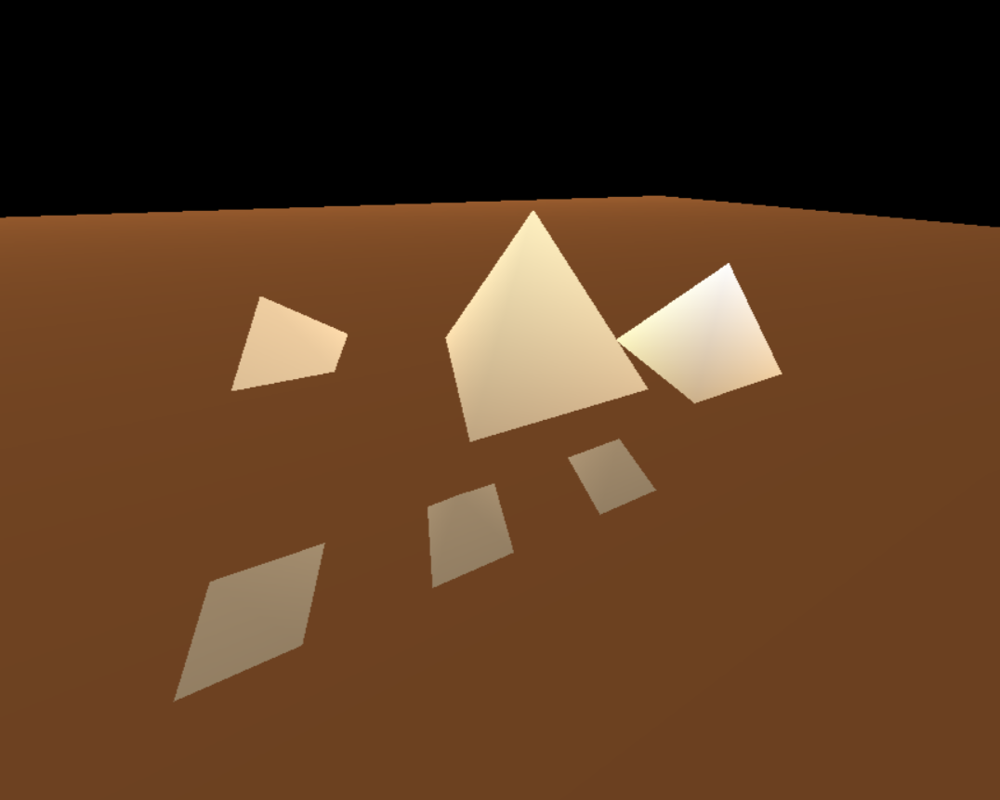
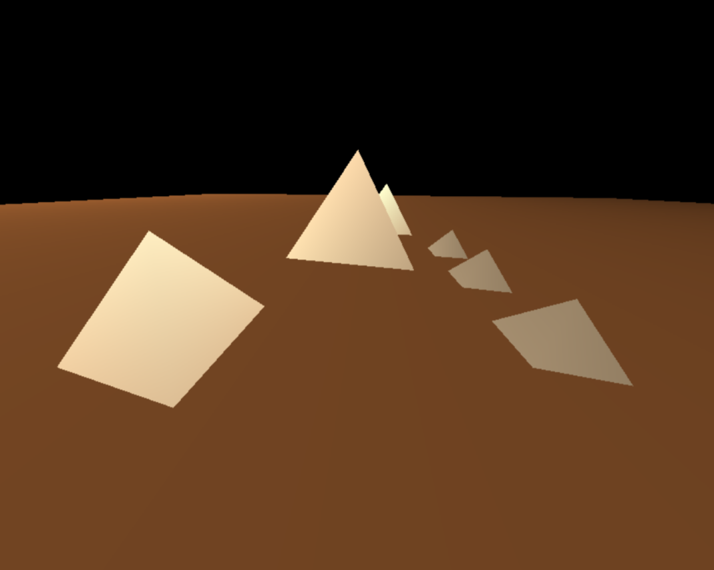

## Introduction 

Computer graphics play a crucial role in creating realistic and visually appealing scenes in various applications, from video games to simulations. One fundamental aspect of realistic graphics is lighting, which simulates the way light interacts with surfaces to create shadows, highlights, and depth. In this blog post, we will explore the basics of lighting in computer graphics and implement it using OpenGL on a set of pyramids.

## The Basics of Lighting

### Ambient Lighting

Ambient lighting represents the overall illumination in a scene. It provides a base level of light that evenly illuminates all surfaces. Think of it as the background lighting that prevents complete darkness.

### Diffuse Lighting

Diffuse lighting simulates the way light scatters and reflects off surfaces. It is responsible for creating the basic color of an object. Surfaces facing the light source appear brighter, while those facing away are darker.

### Specular Lighting

Specular lighting adds highlights to a surface, simulating the reflection of a light source. It creates shiny spots on objects, enhancing their appearance. Specular lighting is crucial for simulating materials like metal or glass.  


## Implementing Lighting in OpenGL

Now, let's delve into the practical implementation of lighting in OpenGL using a set of pyramids.

### The Foundation: Drawing Pyramids

Let's start with the building blocks - pyramids. The drawPyramid function sets the stage by rendering a pyramid with a specified height and base. These parameters allow for versatility in creating pyramids of varying sizes.

``` c++
void drawPyramid(float height, float base) {
    glPushMatrix();

    glBegin(GL_POLYGON);
    glVertex3f(0, height, 0);
    glVertex3f(base / 2, 0, -base / 2);
    glVertex3f(base / 2, 0, base / 2);
    glVertex3f(-base / 2, 0, base / 2);
    glVertex3f(-base / 2, 0, -base / 2);
    glVertex3f(base / 2, 0, -base / 2);

    glEnd();
    glPopMatrix();
}
```

### Setting Up Illumination

To bring our pyramids to life, we delve into the setLighting function. Here, we configure the lighting environment, enable specific lights, and define properties like ambient, diffuse, and specular lighting. Take note of the positioning of light sources.

``` c++
void setLighting() {

    //enabling lighting
    glLightModeli(GL_LIGHT_MODEL_LOCAL_VIEWER, GL_TRUE);
    glEnable(GL_LIGHTING);
    glEnable(GL_LIGHT0);
    glEnable(GL_LIGHT1);

    // Set lighting intensity and color
    GLfloat qaAmbientLight[] = { 0.2, 0.2, 0.2, 1.0 };
    GLfloat qaDiffuseLight[] = { 0.8, 0.8, 0.8, 1.0 };
    GLfloat qaSpecularLight[] = { 1.0, 1.0, 1.0, 1.0 };

    //All 3 componenets set for LIGHT_0
    glLightfv(GL_LIGHT0, GL_AMBIENT, qaAmbientLight);
    glLightfv(GL_LIGHT0, GL_DIFFUSE, qaDiffuseLight);
    glLightfv(GL_LIGHT0, GL_SPECULAR, qaSpecularLight);

    //Only the ambient componenet set for LIGHT_1
    glLightfv(GL_LIGHT1, GL_AMBIENT, qaAmbientLight);
   
    // Set the light position
    GLfloat qaLightPosition0[] = { 0.0, 1.0, -.5, 1.0 };
    glLightfv(GL_LIGHT0, GL_POSITION, qaLightPosition0);

    GLfloat qaLightPosition1[] = {3, 1.0, 2,0.6 };
    glLightfv(GL_LIGHT0, GL_POSITION, qaLightPosition1);
}
``` 

## Adding Material Properties

 We also infuse material properties to the pyramid. Colors, shininess, and shading models come into play, creating a realistic appearance.

 ``` c++ 

 void drawPyramidWithLighting(float height,float base) {

    GLfloat qaWhite[] = { 1.0, 1.0, 1.0, 1.0 };
    GLfloat pyramidBody[] = { 0.9607, 0.827, 0.647,1.0};

    glPushMatrix();

    glShadeModel(GL_SMOOTH);
    glMaterialfv(GL_FRONT, GL_AMBIENT, pyramidBody);
    glMaterialfv(GL_FRONT, GL_DIFFUSE, pyramidBody);
    glMaterialfv(GL_FRONT, GL_SPECULAR, qaWhite);
    glMaterialf(GL_FRONT, GL_SHININESS, 50.0);
   
    drawPyramid(height,base);
    glPopMatrix();
}
```

## Crafting the Scene: Drawing Ground and Multiple Pyramids

To complete our illuminated landscape, we introduce the drawGround function, which draws a flat base. The drawPyramids function orchestrates the positioning of multiple pyramids, showcasing the flexibility of our lighting setup.

 ``` c++ 
void drawGround() {
    GLfloat ground[] = { 0.5, 0.3, 0.15, 1.0 };
    GLfloat qaWhite[] = { 1.0, 1.0, 1.0, 1.0 };
    glPushMatrix();

    glShadeModel(GL_SMOOTH);
    glMaterialfv(GL_FRONT_AND_BACK, GL_AMBIENT, ground);
    glMaterialfv(GL_FRONT_AND_BACK, GL_DIFFUSE, ground);
    glMaterialfv(GL_FRONT_AND_BACK, GL_SPECULAR, qaWhite);
    glMaterialf(GL_FRONT_AND_BACK, GL_SHININESS, 128.0);
    glBegin(GL_POLYGON);
    glVertex3f(-40, 0, -40);
    glVertex3f(40, 0, -40);
    glVertex3f(40, 0, 40);
    glVertex3f(-40, 0, 40);
    glEnd();
    glPopMatrix();
}

void drawPyramids() {
    float height = 3, base = 3.5;
    drawPyramidWithLighting(height, base);
    glPushMatrix();
    glTranslatef(3.5 * 1, 0, 4.6 * 0.25);
    drawPyramidWithLighting(height * 0.7, base * 0.7);
    glPopMatrix();

    glPushMatrix();
    glTranslatef(-5, 0, -2);
    drawPyramidWithLighting(height * 0.5, base * 0.5);
    glPopMatrix();

    glPushMatrix();
    glTranslatef(0, 0, 3);
    drawPyramidWithLighting(height * 0.25, base * 0.25);
    glTranslatef(-2, 0, 0);
    drawPyramidWithLighting(height * 0.25, base * 0.25);
    glTranslatef(-2, 0, 0);
    drawPyramidWithLighting(height * 0.25, base * 0.25);
    glPopMatrix();

}
```
## Output 



