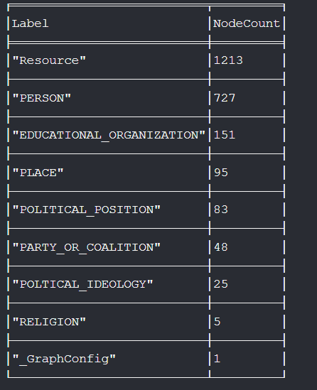
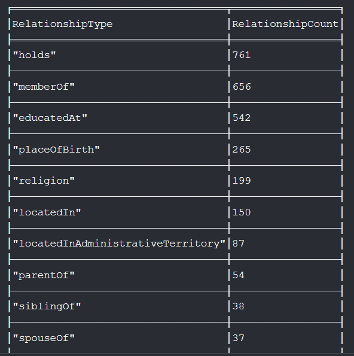
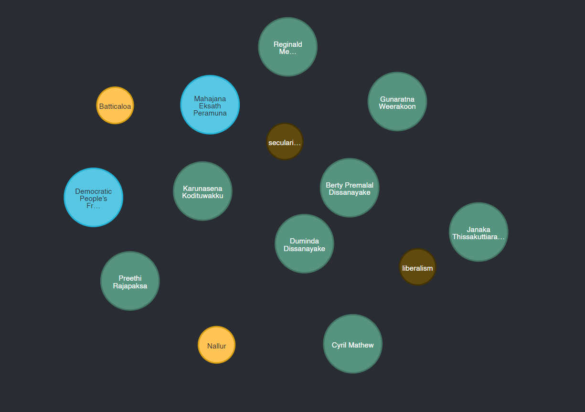
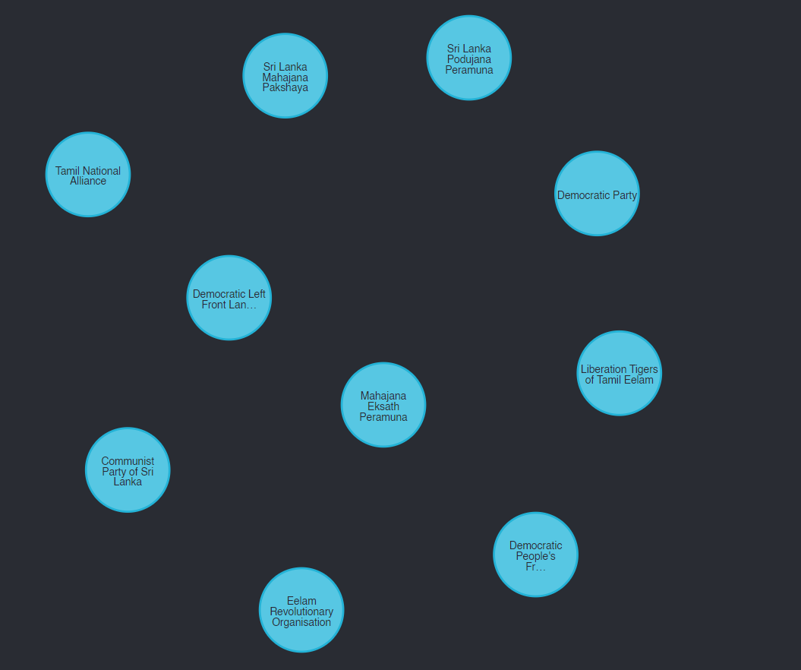

In this article, I will walk through the process of ingesting RDF data into Neo4j using neosemantics. We'll cover setting up the neosemantics , importing the data, visualizing the graph and performing some basic queries and analysis.

neosemantics (n10s) is a plugin that enables the use of RDF and its associated vocabularies like (OWL,RDFS,SKOS and others) in Neo4j.

## Setting Up neosemantics

First, ensure that you have Neo4j installed and the neosemantics (n10s) plugin enabled for your neo4j project. The easiest way to install n10s is via the Neo4j Desktop application from the plugins tab.After enabling the plugin the following CYPHER (neo4j's query language) commands should be run from your graph database.

1. Create a Unique Constraint

   To ensure that each resource URI is unique in the graph, create a constraint:

   ```cypher
   CREATE CONSTRAINT n10s_unique_uri FOR (r:Resource)
   REQUIRE r.uri IS UNIQUE
   ```

2. Initialize n10s

   Initialize the n10s configuration:

   ```cypher
   CALL n10s.graphconfig.init()
   ```

3. Set Configuration Options

   Set configuration options as needed. In this case, we choose to ignore vocabulary URIs:

   ```cypher
   CALL n10s.graphconfig.set({ handleVocabUris: "IGNORE" })
   ```

4. Import RDF Data

   Finally, import the RDF data from the Turtle file. Ensure the file path is correct and that Neo4j has read permissions for the file. Here we are importing the graph created in the previous post that has information about Sri Lankan politics.

   ```cypher
   CALL n10s.rdf.import.fetch("file:///C:/...../merged_graph.ttl", "Turtle")
   ```

## Graph infomation

Once the data is loaded we can query to get some basic infomation about the graph.

1. Label details for the graph

    ```cypher
    MATCH (n)
    WITH labels(n) AS labels, count(*) AS count
    UNWIND labels AS label
    RETURN label AS Label, sum(count) AS NodeCount
    ORDER BY NodeCount DESC
    ```
     
2. Relationships connecting nodes

    ```cypher
    MATCH ()-[r]->()
    RETURN type(r) AS RelationshipType, count(*) AS RelationshipCount
    ORDER BY RelationshipCount DESC
    ```
    

## Visualizing the Graph

You can also visualize the graph using the Neo4j Browser.

1. View some random nodes:

   ```cypher
   MATCH (n) RETURN n LIMIT 25
   ```
   

2. Filter by specific labels or properties:

   For example, to view all nodes labeled `PARTY_OR_COALITION`:
   ```cypher
   MATCH (n:PARTY_OR_COALITION) RETURN n LIMIT 10
   ```
     

## Conclusion

By following these steps, you can successfully ingest RDF data into Neo4j using the n10s plugin. This setup allows you to leverage the power of graph databases for advanced querying and analysis of interconnected data.