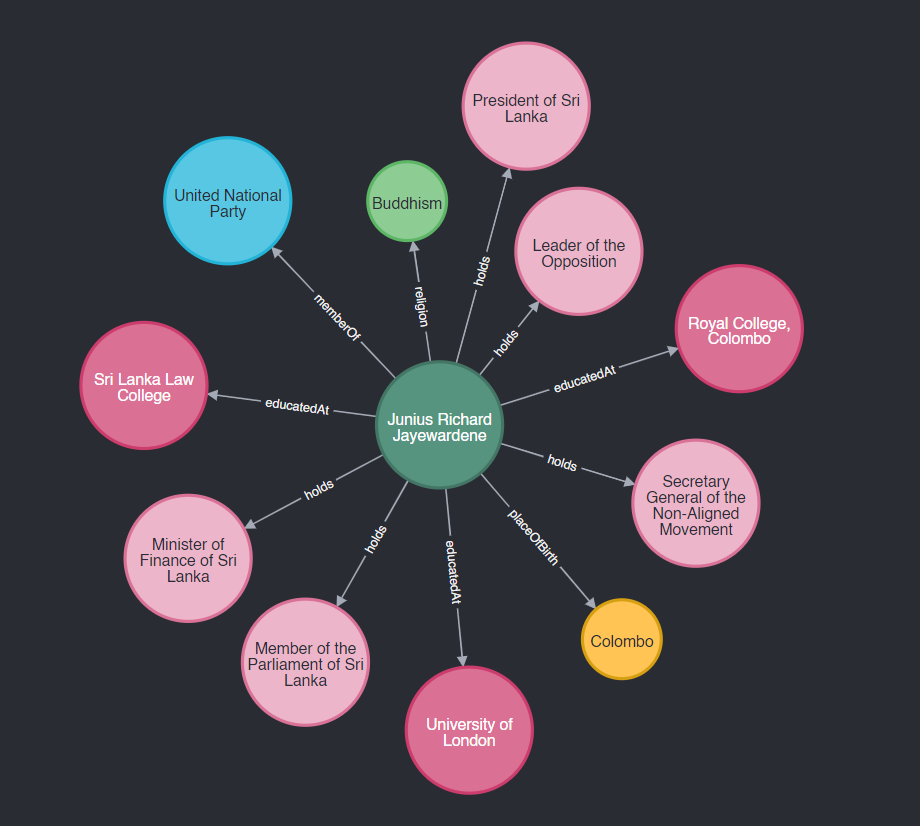
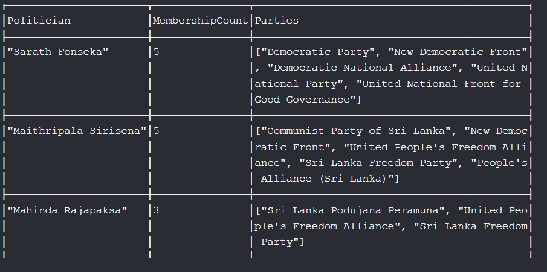
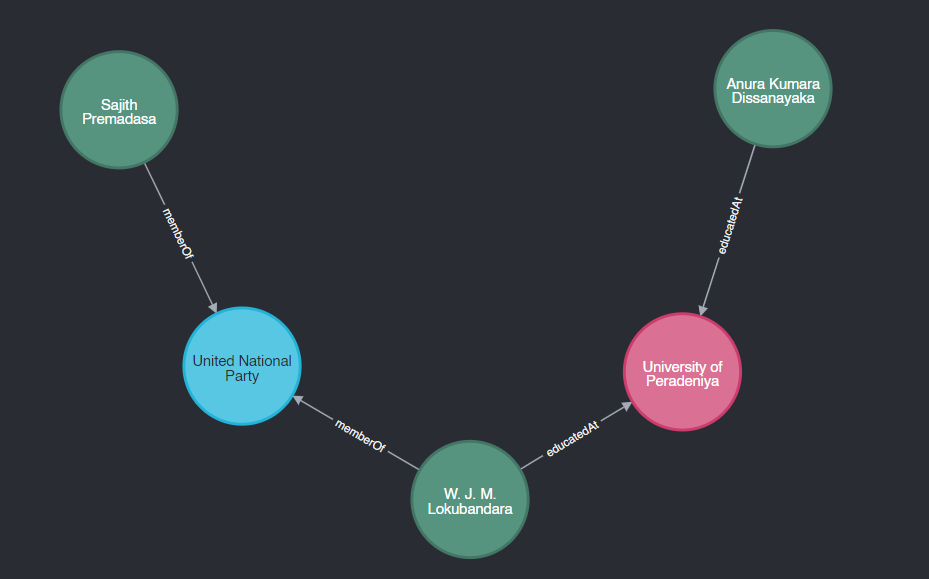
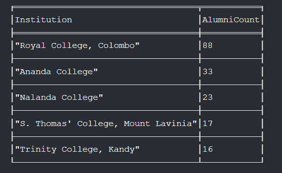
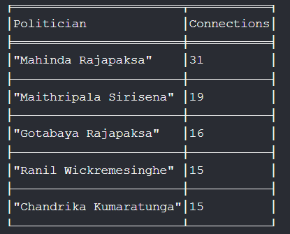
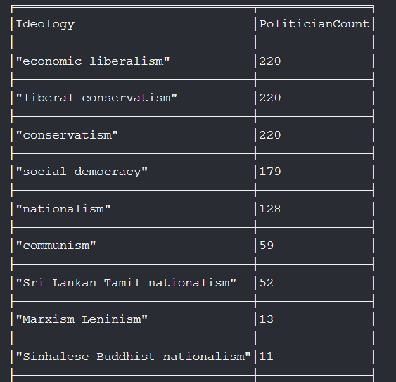

### Introduction

In this article, we will perform some more in-depth querying on the knowledge graph of Sri Lankan politics we created earlier. This knowledge graph contains rich data about the Sri Lankan political landscape.

### Querying a Single Entity

A basic operation is to query for a single entity. Here, we try to get the node of the second President of Sri Lanka, J. R. Jayewardene. The following Cypher query will return the target node:

```cypher
MATCH (n:PERSON {label: 'Junius Richard Jayewardene'}) 
RETURN n
```

Upon expansion, we can get the following visualization in the browser:



Notice the nodes, relationships, and color coding according to labels. This simple query helps in isolating specific individuals within the graph.

### Finding Politicians with the Most Party Memberships

Next, let's find out which politicians have the most number of party memberships. Here, we aim to get the top 3:

```cypher
MATCH (p:PERSON)-[r:memberOf]->(party:PARTY_OR_COALITION)
WITH p, COUNT(r) AS MembershipCount, COLLECT(party.label) AS Parties
ORDER BY MembershipCount DESC
LIMIT 3
RETURN p.label AS Politician, MembershipCount, Parties
```

This query will return a list of politicians, the count of their party memberships, and the parties they are associated with.



### Shortest Path Analysis

Shortest path analysis is a powerful method to uncover the most direct connections between two entities. This can be particularly insightful in political networks, where relationships and affiliations play a crucial role.

We can use common algorithms such as Dijkstra's or A* for shortest path calculation. In Neo4j, the `shortestPath` function provides an efficient way to find the shortest path between nodes. Here, we demonstrate how to find the shortest path between two prominent Sri Lankan politicians, Sajith Premadasa and Anura Kumara Dissanayake, allowing only specific types of relationships:

```cypher
MATCH (start:PERSON {label: 'Sajith Premadasa'}), (end:PERSON {label: 'Anura Kumara Dissanayake'})
MATCH path = shortestPath((start)-[:educatedAt|memberOf*]-(end))
RETURN path
```

This query restricts the path to only include `educatedAt` and `memberOf` relationships. The result will show the shortest path, if it exists, between the two politicians through their educational institutions and party memberships.



### Additional Insights

Beyond these basic and advanced queries, you can extract various other insights from the knowledge graph. Here are a few examples:

1. **Top Educational Institutions for Politicians**:
    ```cypher
    MATCH (e:EducationalInstitute)<-[:educatedAt]-(p:PERSON)
    RETURN e.label AS Institution, COUNT(p) AS AlumniCount
    ORDER BY AlumniCount DESC
    LIMIT 5
    ```
    

2. **Most Connected Politician** (by the number of relationships):
    ```cypher
    MATCH (p:PERSON)-[r]-()
    RETURN p.label AS Politician, COUNT(r) AS Connections
    ORDER BY Connections DESC
    LIMIT 5
    ```
    

3. **Politicians by Ideology**:
    ```cypher
    MATCH (p:PERSON)-[:memberOf]->(:PARTY_OR_COALITION)-[:hasIdeology]->(i:POLTICAL_IDEOLOGY)
    RETURN i.label AS Ideology, COUNT(p) AS PoliticianCount
    ORDER BY PoliticianCount DESC   
    ```
    


### Conclusion

Using Neo4j and Cypher queries, we can perform powerful and insightful analyses on a knowledge graph. From querying individual entities to performing complex shortest path analysis and uncovering hidden patterns. Next we will try to look at some powerful features that are exclusive to graph databases like centrality measures and clustering nodes.

---