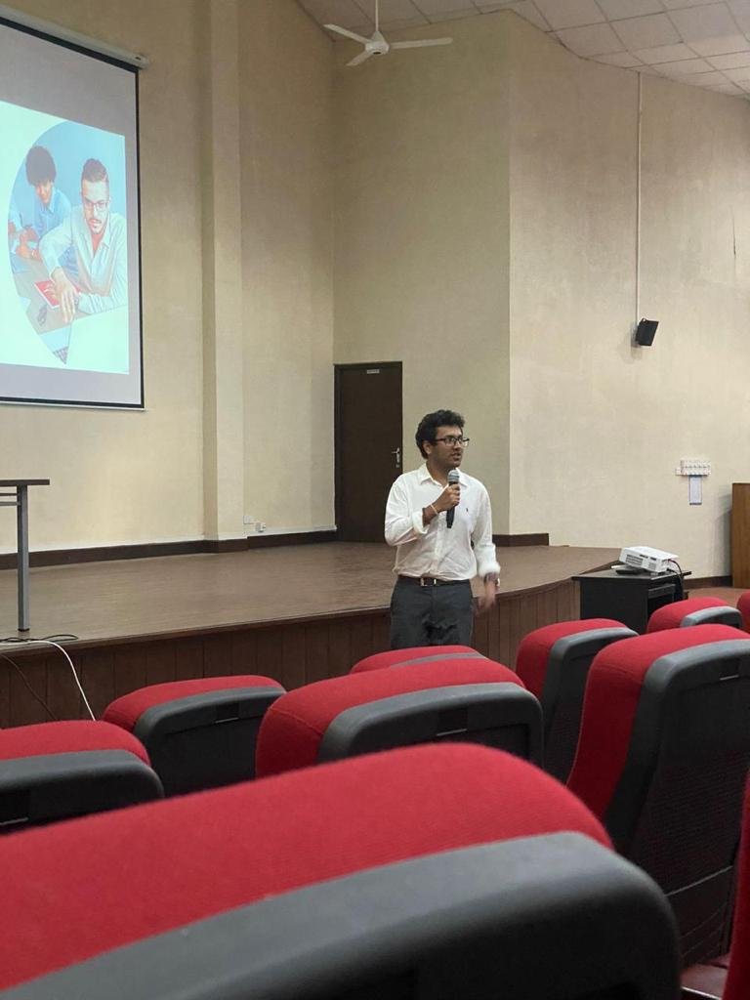
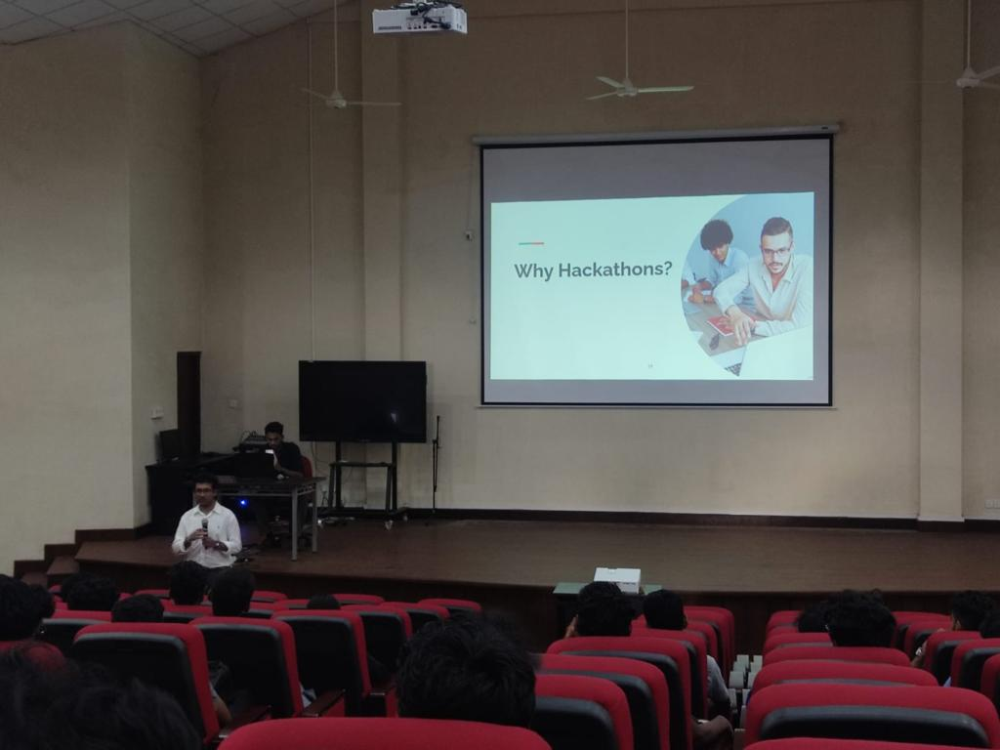
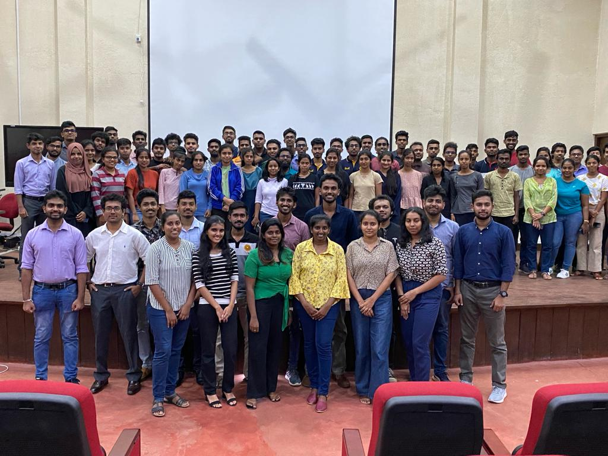

Co-organzied and conducted a hackathon awareness session for the S19 and S20 Batches of the Faculty of Science University of Peradeniya.Shared my experiences from participating in hackathons with the juniors.Event was concluded with a mini-hackathon to give them hands-on experience.

