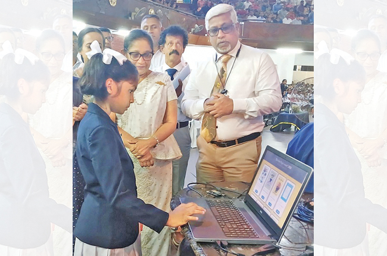

[E-Library Mahamaya Girls College - දිවිය දිනන විද්‍යුත් පොතක්](https://elibrary.mahamayagirlscollege.lk/)

In a groundbreaking achievement, Mahamaya Girls' College in Kandy set a global precedent by releasing more than 700 e-books, all authored by school children, on a single day. This remarkable milestone, achieved on the 24th December 2023, marks a significant leap forward in digital education and creativity.

What makes this initiative('දිවිය දිනන විද්‍යුත් පොතක්') truly exceptional is the diverse participation of school students, including those from remote areas of the country. This book writing program, organized by Mahamaya Girls' School, reached beyond geographical boundaries, showcasing the talent and potential of students from all walks of life.

I was glad to be involved in this venture particularly with the collection of ebooks and with mangement of the SQL database.I was also involved with the website launch on the event day.

[Image source : Daily News](https://www.dailynews.lk/2023/12/25/admin-catagories/breaking-news/313060/five-hundred-e-books-released-in-kandy/)