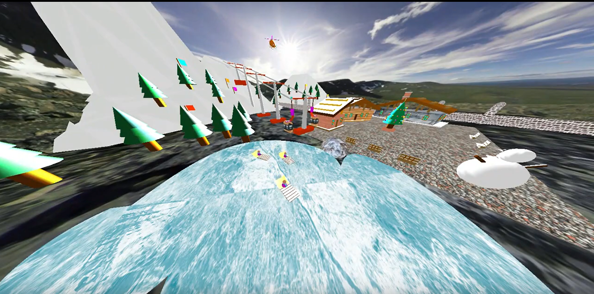
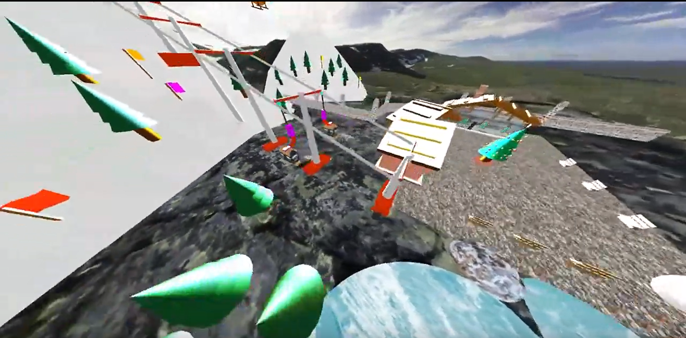
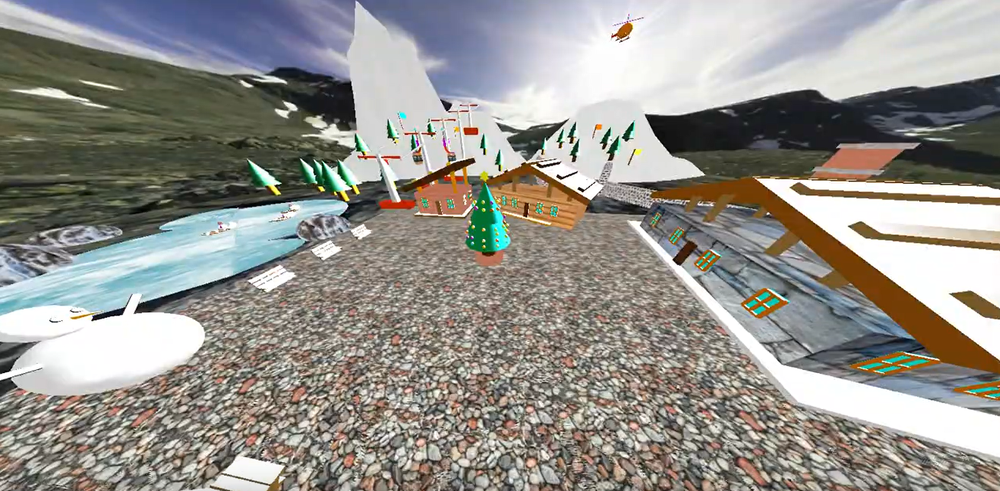

For my CS308: Computer Graphics Programming capstone project, I created a detailed 3D model of a hillside ski resort using legacy OpenGL. This project showcases skills in computer graphics and graphics programming best practices.

The 3D model features a scenic ski resort complete with ski lifts, slopes, and cabins. Controllable lighting allows users to experience different times of day and weather conditions, enhancing realism. Camera movements are fully interactive, offering various perspectives and smooth navigation.

Animations, such as moving the ski lift and skiers, bring the resort to life and were crafted using foundational graphics principles. External textures, integrated with the SOIL2 library, add detail and richness to the scene, from wood grain on cabins to snowy slopes. A skybox creates a seamless and immersive background, enhancing depth and realism.

Good programming practices, including modular design and code reuse, were emphasized throughout the project. This approach ensured efficient development and maintainability.

