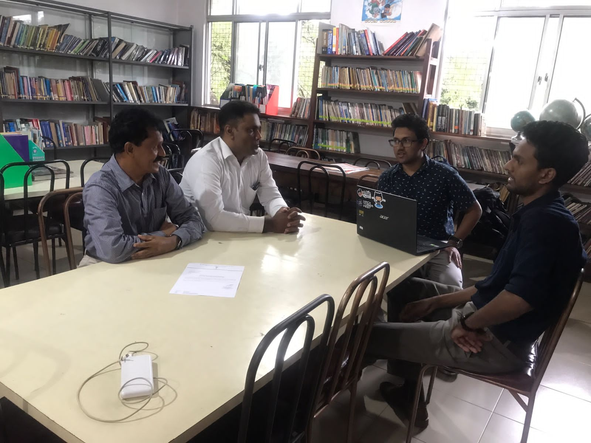

## Description:

Analyzed requirements and developed a full-stack application to digitize the cataloging of over 10,000 library items for a national school in Kandy. The system includes item handling, basic authentication,    barcode generation and supports the Dewey Decimal Classification system. 

Also in conjunction provided assistance to launch [‘Diviya Dinana Vidyuth Pothak’]( "ongoing series of articles") initiative which successfully released more than 700 student-written e-books to the web.

