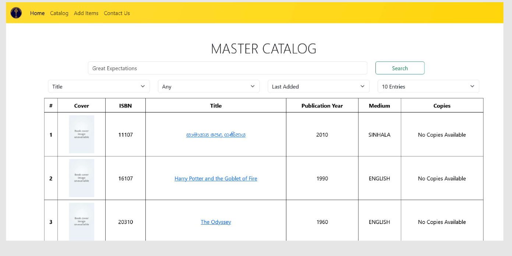

## Description:

Was involved in creating a web application to handle cataloging of the Mahamaya Girl's College Kandy library (10,000+ items) for digitalization of library facilities.

Application with standard features to handle library items along with authentication.

