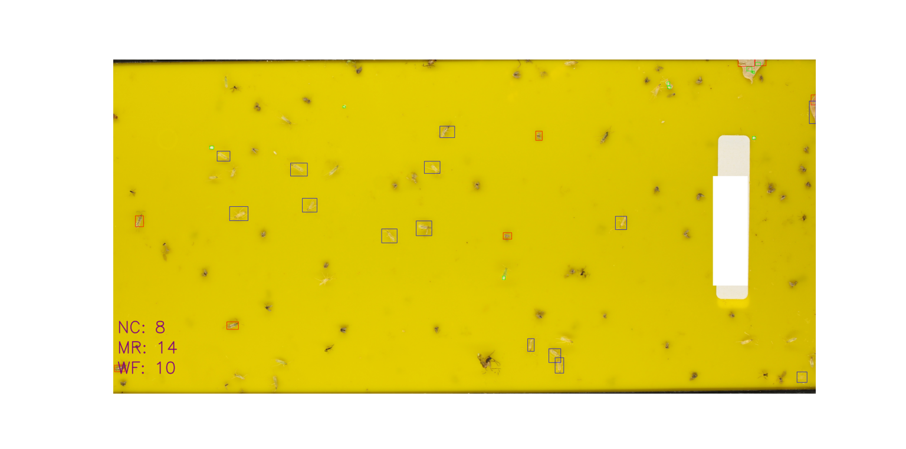

In agricultural research, the manual task of counting and categorizing insects on yellow
sticky traps has long been known for its challenges, including time consumption and
potential errors. In this project, an innovative solution is proposed based on image
processing techniques. This method involves several steps, including image enhancement,
the removal of unwanted elements, and classification based on color information. The
main objective of this approach would be the automated classification and counting of
three insect types: Whitefly, Macrolophus, and Nesidiocoris. The results demonstrate
improvements in efficiency and accuracy compared to manual counting methods.
Moreover, this system could be integrated into data analysis workflows, enabling timely
monitoring and decision support in agricultural contexts. This proposed solution
emphasizes the potential of image processing as a practical and resource-efficient tool,
with promising implications for entomological research and agricultural pest management.

